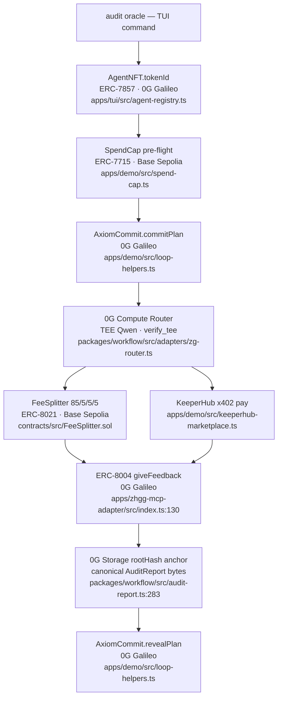
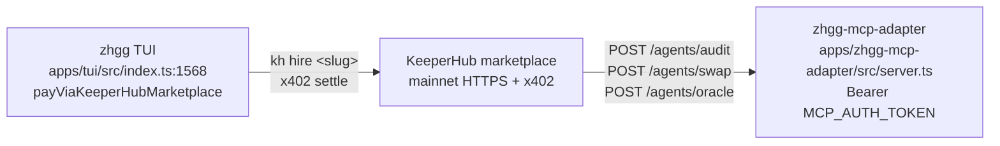

# zhgg

On-chain AI agents that audit compliance on 0G and trade workflows over KeeperHub with a Terminal User Interface (TUI), allowing your agents to  hire third-party KeeperHub workflows over x402, and KeeperHub workflows can hire yours via
the same MCP-callable HTTP surface. Every audit produces a tamper-proof
EU AI Act evidence chain anchored on 0G Storage + ERC-8004.**

> Status: contracts deployed on 0G Galileo (16602) + Base Sepolia (84532).
> Built for ETHGlobal OpenAgents — submitting to **0G Labs** ($15K), **KeeperHub**
> ($4.5K + $500 feedback), and **EIP-standards** depth signals.

Live testnet addresses — see [Deployed contracts](#deployed-contracts) below.

## Headline scenario



## Bidirectional KH ↔ zhgg loop



zhgg consumes KH (left arrow), zhgg agents are exposed AS KH-callable
workflows (right arrow). Same x402 settlement, same MCP-shaped
JSON envelopes, same ERC-8004 reputation evidence on both directions.

## Quick links

| Doc | Purpose |
|---|---|
| [`docs/ARCHITECTURE.md`](./docs/ARCHITECTURE.md) | full system diagram + data flows |
| [`docs/AUDIT-REPORT-SCHEMA.md`](./docs/AUDIT-REPORT-SCHEMA.md) | EU AI Act canonical report + verification recipe |
| [`docs/INTEGRATION-MAP.md`](./docs/INTEGRATION-MAP.md) | package import graph + contract caller map |
| [`docs/DEPLOY_RUNBOOK.md`](./docs/DEPLOY_RUNBOOK.md) | end-to-end testnet deploy (forge + smoke + MCP) |
| [Deployed contracts](#deployed-contracts) | all 10 contract addresses by chain (0G Galileo + Base Sepolia) |
| [`tasks/integration-audit-final.md`](./tasks/integration-audit-final.md) | what's wired, gaps, risk register |
| [`tasks/partner-alignment.md`](./tasks/partner-alignment.md) | KH/0G/EIP scoring with file:line evidence |
| [`tasks/intent-commands.md`](./tasks/intent-commands.md) | every TUI intent + verified status |
| [`.env.example`](./.env.example) | env-var matrix (required / filled-by-deploy / optional) |

---

## Quick start

```bash
git clone https://github.com/LingSiewWin/zhgg && cd zhgg
bun install
cp .env.example .env                          # fill MINT_AGENT_PRIVATE_KEY etc.
bun run check-types                           # 11 packages
bun run apps/tui/src/index.ts                 # raw-ANSI TUI
```

Demo walkthrough (paste into the running TUI):

```
agents                                        # list 3 iNFTs (audit #1 / oracle #2 / swap #3)
balances                                      # OG + ETH + USDC + WETH
ask oracle ETH/USD                            # Pyth Hermes feed
ask oracle eu-ai-act                          # regulatory deltas
kh discover aave                              # KH marketplace search
kh inspect ARYA                               # full inputSchema + price
kh hire <slug> {"foo":"bar"}                  # x402 marketplace round-trip
swap 0.0001 ETH WETH                          # Uniswap V3 SwapRouter02
mint audit                                    # ERC-7857 iNFT on 0G
audit oracle                                  # full 10-step orchestrator (gated on ZG_ROUTER_KEY)
```

Full walkthrough: [`docs/DEPLOY_RUNBOOK.md`](./docs/DEPLOY_RUNBOOK.md).

---

## What's working

### Workspace agent packages (`apps/`)

| Package | Purpose | Status |
|---|---|---|
| `@zhgg/tui` (`apps/tui`) | Raw-ANSI dispatcher; 29 intents over 7 tiers | ✓ refuses on missing env, real I/O |
| `@zhgg/audit-agent` (`apps/agents/audit`) | EU AI Act probes via TEE Qwen + verdict aggregator | ✓ ([`runAudit.ts`](./apps/agents/audit/src/runAudit.ts)) |
| `@zhgg/oracle-agent` (`apps/agents/oracle`) | Pyth Hermes price feed + regulatory deltas | ✓ ([`apps/agents/oracle/src/index.ts:11`](./apps/agents/oracle/src/index.ts)) |
| `@zhgg/keeperhub-agent` (`apps/keeperhub-agent`) | KH HTTP client (discover/inspect/trigger/status/workflows/integrations) | ✓ ([`endpoints/`](./apps/keeperhub-agent/src/endpoints/)) |
| `@zhgg/swap-agent` (`apps/swap-agent`) | Uniswap V3 SwapRouter02 on Base, fee tiers `[500, 3000, 10000]` | ✓ |
| `@zhgg/transfer-agent` (`apps/transfer-agent`) | ERC-20 + native transfer with ENS resolve | ✓ |
| `@zhgg/mint-agent` (`apps/mint-agent`) | ERC-7857 mint + per-iNFT receiver wallet + optional ENS subname | ✓ |
| `@zhgg/mcp-adapter` (`apps/zhgg-mcp-adapter`) | HTTP server exposing audit/oracle/swap as KH-callable | ✓ honest 503 on missing env |
| `@zhgg/demo` (`apps/demo`) | Cross-agent orchestrator + smoke test + cross-agent CLI | ✓ |
| `@zhgg/tee-verifier` (`apps/tee-verifier`) | dstack quote sidecar, structural mode | ⚠ deployed but not wired into orchestrator |
| `web` (`apps/web`) | Static homepage; not on agent path | ✓ |

### Shared packages (`packages/`)

| Package | Purpose |
|---|---|
| `@zhgg/workflow` | Audit report writer, x402 settle, delegation EIP-712, storage-log, multi-leg relay, 0G TEE inference plugin |
| `@zhgg/router` | Mode classifier + provider pool (mock-stack, demo-only path) |
| `@zhgg/oracle-data` | Static EU AI Act + MiCA + GDPR-AI deltas (no I/O) |
| `@zhgg/wallet-aa` | ERC-4337 user-op + paymaster encoder — `aa deploy` + `aa send` wired on TUI dispatch path |
| `@my-better-t-app/env` | Web env schema |
| `@my-better-t-app/ui` | Web component lib |
| `@my-better-t-app/config` | Shared tsconfig presets |


iNFTs minted: `audit=#1`, `oracle=#2`, `swap=#3` — identity lives on the AgentNFT contract on 0G Galileo, not ENS ([`apps/tui/src/agent-registry.ts`](./apps/tui/src/agent-registry.ts)).

---

## Partner alignment

### KeeperHub track ($4,500 + $500 feedback bounty)

| Criterion | File:line evidence | Status |
|---|---|---|
| x402 marketplace pay-and-trigger (consumer) | [`apps/demo/src/keeperhub-marketplace.ts:60-122`](./apps/demo/src/keeperhub-marketplace.ts) bound at [`apps/tui/src/index.ts:1568`](./apps/tui/src/index.ts) | ✓ |
| Workflow consumption (discover/inspect/trigger/status/workflows/integrations) | [`apps/keeperhub-agent/src/index.ts:74-147`](./apps/keeperhub-agent/src/index.ts); endpoints in [`apps/keeperhub-agent/src/endpoints/`](./apps/keeperhub-agent/src/endpoints/) | ✓ |
| HMAC-signed Turnkey wallet integration | [`apps/demo/src/keeperhub-marketplace.ts:31-44`](./apps/demo/src/keeperhub-marketplace.ts) consuming `WalletConfig{subOrgId, walletAddress, hmacSecret}` | ✓ |
| Real on-chain x402 facilitator settlement | [`packages/workflow/src/x402.ts:1-90`](./packages/workflow/src/x402.ts) (`https://x402.org/facilitator`) | ✓ |
| Producing workflows BACK to KH (publish plugin) | Plugin authored at [`packages/workflow/plugins/0g-tee-inference/`](./packages/workflow/plugins/0g-tee-inference/) but never opened a PR to `KeeperHub/keeperhub` | ⚠ |
| `kh publish` arm in TUI (register `<ens>`) | Not wired ([`tasks/intent-commands.md:125`](./tasks/intent-commands.md)) | ⚠ |
| Bidirectional flywheel — zhgg agents AS KH-callable workflows | [`apps/zhgg-mcp-adapter/src/server.ts:68`](./apps/zhgg-mcp-adapter/src/server.ts) routes; bearer + Slice-Y canonical receipts | ✓ |
| Builder feedback bounty content | Raw research at [`docs/keeperhub.md:467-573`](./docs/keeperhub.md) — needs promotion to canonical `FEEDBACK.md` | ⚠ |

### 0G Labs track ($15,000 — $7.5K framework + $7.5K agents+iNFT)

| Criterion | File:line evidence | Status |
|---|---|---|
| ERC-7857 iNFT — 3 real tokens on Galileo | [`contracts/src/AgentNFT.sol:26-95`](./contracts/src/AgentNFT.sol) full IERC7857; deployed `0x5298…638f`; verified live `agents` intent returns 75B/231B/173B caps | ✓ |
| ERC-8004 reputation — `giveFeedback` per audit | [`contracts/src/AgentRegistry.sol:23-121`](./contracts/src/AgentRegistry.sol); `giveFeedback` at [`apps/zhgg-mcp-adapter/src/index.ts:131-152`](./apps/zhgg-mcp-adapter/src/index.ts); CAIP-2 `eip155:16602:<registry>` | ✓ |
| 0G Compute Router with `verify_tee:true` | [`packages/workflow/src/adapters/zg-router.ts:18-104`](./packages/workflow/src/adapters/zg-router.ts) sets `verify_tee:true`, parses `body.trace.tee_verified`, falls back to `x-tee-attestation` header | ⚠ header not always emitted by hosted router (honest comment [`tee-attestation.ts:12-19`](./packages/workflow/src/tee-attestation.ts)) |
| 0G Storage adapter — canonical AuditReport bytes | [`packages/workflow/src/storage-log-zg.ts`](./packages/workflow/src/storage-log-zg.ts) wraps `@0gfoundation/0g-ts-sdk`; opt-in via `ZG_STORAGE_ENABLED=1` ([`audit-report.ts:283-287`](./packages/workflow/src/audit-report.ts)) | ⚠ flag-gated; orchestrator path pins, MCP path returns `feedbackURI=""` by design |
| Slice-Y canonical AuditReport (deterministic, key-sorted, self-referential keccak256) | [`packages/workflow/src/audit-report.ts:1-27`](./packages/workflow/src/audit-report.ts); refuses fake URI [`:283-287`](./packages/workflow/src/audit-report.ts) | ✓ |
| Track 1 framework — 0G TEE Inference KH plugin | [`packages/workflow/plugins/0g-tee-inference/`](./packages/workflow/plugins/0g-tee-inference/) first-class KH-shaped plugin; `_integrationType` exported | ✓ |
| Track 2 autonomous agents | 3 iNFT-bound agents with real capability bytes; orchestrator at [`apps/demo/src/cross-agent.ts`](./apps/demo/src/cross-agent.ts); per-agent receiver wallets + 4-way 85/5/5/5 split + per-call ERC-8004 reputation | ✓ |

### EIP standards (cross-cutting differentiator)

| EIP | Reality | File:line |
|---|---|---|
| **ERC-7857** (iNFT) | Tokens 1/2/3 live on Galileo | [`contracts/src/AgentNFT.sol`](./contracts/src/AgentNFT.sol) |
| **ERC-8004** (reputation) | `giveFeedback` per audit + CAIP-2 endpoint | [`contracts/src/AgentRegistry.sol`](./contracts/src/AgentRegistry.sol) |
| **ERC-7710** (delegations) | EIP-712 sign + on-chain `redeemDelegations` | [`contracts/src/DelegationManager.sol`](./contracts/src/DelegationManager.sol); [`apps/tui/src/index.ts:799-878`](./apps/tui/src/index.ts) |
| **ERC-7715** (spend caps) | Audit pre-flight + grant `[G]`; deployed with `enforced=false` (checks + logs, does not hard-block) | [`contracts/src/SpendCap.sol`](./contracts/src/SpendCap.sol); [`apps/demo/src/spend-cap.ts`](./apps/demo/src/spend-cap.ts) |
| **ERC-8183** (agentic commerce / ACP escrow) | `acp create / acp release` on 0G Galileo | [`contracts/src/AgenticCommerce.sol`](./contracts/src/AgenticCommerce.sol); [`apps/tui/src/acp-intents.ts`](./apps/tui/src/acp-intents.ts) |
| **ERC-4626** (yield vault) | `parkIdle/withdrawIdle` via `AgentReceiverWallet` + `MockERC4626` | [`contracts/src/AgentReceiverWallet.sol:60-321`](./contracts/src/AgentReceiverWallet.sol) |
| **ERC-4337** (account abstraction) | `aa deploy` + `aa send` UserOp via Pimlico bundler; factory on Base Sepolia | [`contracts/src/AgentSimpleAccount.sol`](./contracts/src/AgentSimpleAccount.sol); [`packages/wallet-aa/`](./packages/wallet-aa/); [`apps/tui/src/index.ts`](./apps/tui/src/index.ts) |
| **EIP-8021** (calldata-suffix attribution) | `0x8021…8021` suffix appended by FeeSplitter on every split | [`contracts/src/lib/ERC8021Suffix.sol`](./contracts/src/lib/ERC8021Suffix.sol); [`contracts/src/FeeSplitter.sol:42-44`](./contracts/src/FeeSplitter.sol) |
| ERC-721 / ERC-20 | Underlying primitives | OpenZeppelin v5 |

**Honesty note** — synthetic-inference fallback exists at [`apps/demo/src/live-deps.ts:180-200`](./apps/demo/src/live-deps.ts) (returns `provider_id: 'qwen3.6-plus-mock'`, `receipt: cmpl-mock-N`, marker `0x6d6f636b…`). The TUI dispatch path bails at [`apps/tui/src/index.ts:223`](./apps/tui/src/index.ts) (`if (!bundle.inferenceReady)`) so this branch is **unreachable from TUI dispatch**. CLI `--live` mode without `ZG_ROUTER_KEY` does reach it. The marker is greppable on purpose so judges can confirm.

---

## Deployed contracts

All contracts verified on-chain. Sources pinned to commit
[`1cbf6ee`](https://github.com/LingSiewWin/zhgg/commit/1cbf6ee) — the
deployment commit. If local source has diverged, run `scripts/verify-contracts.sh`
from a worktree at that commit (see comment at top of the script).

### 0G Galileo — chain 16602

Explorer: <https://chainscan-galileo.0g.ai>

| Contract | Standard | Address | Verified |
|---|---|---|---|
| `AgentNFT` | ERC-7857 (iNFT) | [`0x5298f4d8…638f`](https://chainscan-galileo.0g.ai/address/0x5298f4d8d8043c14e5f2683ad642febc8b54638f) | ✓ |
| `AgentRegistry` | ERC-8004 (reputation) | [`0xe78f6c23…16b1`](https://chainscan-galileo.0g.ai/address/0xe78f6c235fd1686547dbea41f742d649607316b1) | ✓ |
| `AxiomCommit` | — | [`0xa471d2c4…859d`](https://chainscan-galileo.0g.ai/address/0xa471d2c45f03518e47c7fc71c897d244df01859d) | ✓ |
| `AgenticCommerce` | EIP-8183 (ACP escrow) | [`0x6b90618b…af44`](https://chainscan-galileo.0g.ai/address/0x6b90618b48d199e1d0df75179d26c2b97e80af44) | ✓ |

Constructor args: `AxiomCommit(AgentNFT)`, `AgenticCommerce(owner=0x557E…d09, feeBps=250)`.

### Base Sepolia — chain 84532

Explorer: <https://sepolia.basescan.org>

| Contract | Standard | Address | Verified |
|---|---|---|---|
| `SpendCap` | ERC-7715 (spend permissions) | [`0x666a6466…61a8`](https://sepolia.basescan.org/address/0x666a6466bddd1fb79bda32f00a045c1ec77c61a8) | ✓ |
| `FeeSplitter` | EIP-8021 (calldata attribution) | [`0xb3a9ea5a…47dd`](https://sepolia.basescan.org/address/0xb3a9ea5a72caab795bcf16c7bc5fd2d4863b47dd) | ✓ |
| `OwnerMirror` | — | [`0x49976ae8…3c7`](https://sepolia.basescan.org/address/0x49976ae86d28665232c164713c3379e6301a63c7) | ✓ |
| `AgentReceiverWalletFactory` | ERC-4626 (yield vault) | [`0x6848f17d…dd1`](https://sepolia.basescan.org/address/0x6848f17d55b8df970df17c7a04b1c0e0b6565dd1) | ✓ |
| `DelegationManager` | ERC-7710 (delegations) | [`0xdee1f561…fef`](https://sepolia.basescan.org/address/0xdee1f561d685cdced4c6caaa40f8c6f7112dffef) | ✓ |
| `AgentSimpleAccountFactory` | ERC-4337 (account abstraction) | [`0x1eea5c29…304`](https://sepolia.basescan.org/address/0x1eea5c29d671af30a2436078caf523919fd44304) | ✓ |

Constructor args: `FeeSplitter(keeperhub, zhgg, commons)` all `0x557E…d09`,
`OwnerMirror(owner=0x557E…d09)`,
`AgentReceiverWalletFactory(OwnerMirror, FeeSplitter)`,
`DelegationManager(SpendCap)`,
`AgentSimpleAccountFactory(entryPoint=0x00000000…7da032)`.

---

## Architecture

zhgg is two HTTP services + one TUI + an orchestrator + a contract suite,
all wired through `@zhgg/workflow` primitives. The TUI parses operator
intents and dispatches to per-domain handlers (KH HTTP, Base writes, 0G
writes, ACP escrow, yield, audit). The MCP adapter exposes the same
agents over Bearer-authenticated HTTP so KeeperHub workflows can call
ours. Every audit emits an ERC-8004 receipt + (optionally) a 0G Storage
rootHash anchor of the canonical bytes.

Full diagram: [`docs/ARCHITECTURE.md`](./docs/ARCHITECTURE.md).

```
apps/
  tui                    raw-ANSI dispatcher (29 intents, 7 tiers)
  zhgg-mcp-adapter       HTTP server: /agents/{audit,oracle,swap}/call
  agents/audit           runAudit (TEE Qwen probes + verdict)
  agents/oracle          pyth + regulatory deltas
  keeperhub-agent        KH HTTP client (6 endpoints)
  swap-agent             Uniswap V3 SwapRouter02
  transfer-agent         ERC-20 + native + ENS resolve
  mint-agent             AgentNFT.mint + receiver wallet + ENS subname
  demo                   cross-agent orchestrator + smoke + CLI
  tee-verifier           dstack quote sidecar (structural)
  web                    static homepage
packages/
  workflow               audit-report, x402, delegation, storage-log,
                         multi-leg-relay, across, 0G TEE plugin
  router                 mode classifier + provider pool (demo path)
  oracle-data            static regulatory + price deltas
  wallet-aa              ERC-4337 user-op + paymaster encoder
contracts/
  src/                   12 contracts (7 EIPs touched on-chain)
  test/                  220 forge tests across 14 t.sol files
  script/                Deploy0GContracts, DeployBaseContracts, DeployYieldVault
docs/                    architecture, audit-report-schema, integration-map,
                         deploy runbook, EIP cheat sheets, partner research
scripts/                 fund-zg-router.ts (one-shot 3 OG deposit)
```

---

## The 29 intents

Reference: [`tasks/intent-commands.md`](./tasks/intent-commands.md) (gitignored
locally; tier table mirrored here).

| Tier | Intents | Cost | Effect |
|---|---|---|---|
| **T1 reads** | `balances`, `block`, `agents`, `ask oracle <topic>`, `?`, `[Q]` | free | `eth_getBalance`, `ownerOf`+`capabilities`, Pyth Hermes, regulatory deltas |
| **T2 KH HTTP** | `kh integrations`, `kh workflows`, `kh discover`, `kh inspect`, `kh trigger`, `kh status` | free | KH org + marketplace catalog reads (verified 6 hits on `aave`) |
| **T3 Base writes** | `[G]` grant, `swap`, `transfer`, `delegate`, `kh hire` | ~0.0001 ETH | SpendCap permission, Uniswap V3, ERC-20+ENS, ERC-7710 redeem, x402 marketplace |
| **T4 yield** | `park <amt> <USDC\|WETH>`, `unpark <amt> <USDC\|WETH>` | gas | ERC-4626 deposit/withdraw via AgentReceiverWallet — ⏳ blocked on `YIELD_VAULT_ADDRESS` |
| **T5 0G writes** | `mint <role>`, `commit <id> <plan>`, `reveal <commitId> <plan>` | ~0.001 OG | ERC-7857 mint, AxiomCommit commit/reveal |
| **T6 ACP escrow** | `acp create <agent> <amount>`, `acp release <jobId>` | gas + token | EIP-8183 createJob+approve+fund (3 txs); evaluator-only release |
| **T7 router-gated** | `audit <tokenId\|ens> [eu-ai-act\|mica\|gdpr-ai\|price]` | ~0.005 OG + 0G Compute | Full 10-step orchestrator: capabilities → cap → commit → TEE infer → settle → ERC-8021 → ERC-8004 → storage → memoryRoot → reveal |

29 distinct intents, parser tested at [`apps/tui/src/intent-parser/parsers/`](./apps/tui/src/intent-parser/parsers/).

---

## Audit evidence chain (EU AI Act)

After every `audit <subject>` run, the `audit` agent (iNFT #1) produces a canonical
JSON `AuditReport` with deterministic key-sorted UTF-8 encoding. The
report's `anchors.feedbackHash` is the keccak256 of those exact bytes
with `feedbackHash` itself zeroed (self-referential fixed point). The
hash + 0G Storage rootHash get written on-chain via
`AgentRegistry.giveFeedback` (ERC-8004, [`apps/zhgg-mcp-adapter/src/index.ts:130-152`](./apps/zhgg-mcp-adapter/src/index.ts)).

A regulator scanning `NewFeedback` events on chain 16602 can:

1. extract `(feedbackURI, feedbackHash)` from the event
2. fetch canonical bytes from 0G Storage at `rootHash = feedbackURI`
3. recompute via `canonicalizeAuditReport`
4. compare to `feedbackHash`
5. match → these are the exact bytes the auditor agreed to on-chain

The writer **refuses** to fabricate a fake URI: when storage is
disabled or no client supplied it throws `WriteAuditReportError(storage_disabled|no_client)`
([`packages/workflow/src/audit-report.ts:283-297`](./packages/workflow/src/audit-report.ts)).
Schema, errors, sample, and verification recipe: [`docs/AUDIT-REPORT-SCHEMA.md`](./docs/AUDIT-REPORT-SCHEMA.md).

---

## What's NOT yet wired (honesty section)

From [`tasks/integration-audit-final.md`](./tasks/integration-audit-final.md) §D — features that ship but aren't on the demo dispatch path:

| Feature | Why deployed but isolated | Severity |
|---|---|---|
| `apps/tee-verifier` Bun server | `inferZG` runs `verifyTee:true` non-strict; sidecar's `verifierUrl` only set in tests | 🔴 critical |
| `OwnerMirror` cross-chain attestor | Designed to mirror AgentNFT owner across chains; orchestrator reads owner directly via `AgentNFT.ownerOf` | 🟠 major |
| `packages/workflow/src/across.ts` (Across V3 bridge) | Re-exported, not imported by any app | 🟠 major |
| `multi-leg-relay.ts` (`relayPaymentIntent`) | EIP-712 multi-leg payment intent — no dispatch path; tests pass standalone | 🟠 major |
| `packages/router` mock stack | Headlines demo (`apps/demo/src/index.ts`) exists; TUI never invokes it | 🟠 major |

External blockers (env / faucet only — code is ready):

| Blocker | Cost | Unlocks |
|---|---|---|
| 0G Compute Router ≥3 OG floor (faucet caps 0.1 OG/wallet/day) | external — Discord drip | T7 `audit` |
| `YIELD_VAULT_ADDRESS` deploy (one `forge script DeployYieldVault.s.sol`) | ~0.0001 ETH gas | T4 `park` / `unpark` |
| `KH_AUTHOR_*` env (subOrgId + wallet + HMAC) | request via Telegram `@LucaGra04` | KH x402 hire path (currently falls back to direct FeeSplitter) |
| `ACP_PAYMENT_TOKEN` env + balance | configure | T6 `acp create` / `acp release` |

**Why we shipped what we shipped** — bidirectional KH ↔ zhgg loop is the
differentiator. Closing the AA-wallet + tee-verifier gaps adds two more
"production-ready EIP" headlines but doesn't change the demo's narrative.
The audit-evidence chain (Slice Y) is the hardest engineering and ships
real, end-to-end, with refusal semantics — that's what regulators care about.

---

## Repo structure

```
zhgg/
├── apps/
│   ├── tui/                  raw-ANSI TUI (29 intents)
│   ├── zhgg-mcp-adapter/     HTTP server (Slice Z, Bearer auth)
│   ├── agents/{audit,oracle} per-agent runtime
│   ├── keeperhub-agent/      KH HTTP client + endpoints/
│   ├── {swap,transfer,mint}-agent/  EVM-write agents
│   ├── demo/                 cross-agent orchestrator + smoke + CLI
│   ├── tee-verifier/         dstack quote sidecar
│   └── web/                  static homepage
├── packages/
│   ├── workflow/             audit-report, x402, delegation, storage-log,
│   │   ├── src/              multi-leg-relay, across, adapters/zg-router
│   │   └── plugins/          {0g-tee-inference,oracle} KH plugins
│   ├── router/               mode classifier + mock stack
│   ├── oracle-data/          regulatory deltas
│   ├── wallet-aa/            ERC-4337 user-op + paymaster encoder
│   └── {env,ui,config}/      web baseline (template)
├── contracts/
│   ├── src/                  12 contracts, 7 on-chain EIPs
│   ├── test/                 220 forge tests across 14 t.sol files
│   ├── script/               Deploy0GContracts, DeployBaseContracts, DeployYieldVault
│   └── broadcast/            verified deploy artifacts (16602 + 84532)
├── docs/                     architecture, schema, integration-map, runbook,
│                             specs/EIP-*.md cheat sheets, partner research
├── scripts/                  fund-zg-router.ts
├── tasks/                    integration audit, partner alignment, intent commands
├── .env.example              env-var matrix
└── README.md                 (this file)
```

---

## Tech stack

- **Runtime**: bun
- **Language**: TypeScript strict (no `any` in production paths)
- **Schema**: zod 4
- **EVM**: viem (apps), ethers v6 (0G SDK boundary in `storage-log-zg.ts` only)
- **Solidity**: 0.8.24 + Foundry + OpenZeppelin v5
- **0G**: `@0gfoundation/0g-ts-sdk` (Storage), 0G Compute Router (`router-api-testnet.integratenetwork.work/v1`)
- **x402**: `@x402/core` + `@x402/evm` + `@keeperhub/wallet`
- **MCP**: `@modelcontextprotocol/sdk` (KH HTTP transport)
- **TUI**: `@opentui/core` + raw-ANSI dispatcher
- **AI**: Anthropic Haiku 4.5 (optional classifier, fail-open)

No Python, no Redis, no OPA, no Macaroons, no paywall server.

---

## KeeperHub Submission

### Project name
**zhgg** — Bidirectional Agentic Commerce Runtime

### Team
- **Sean Hoe Kai Zher** — Full-stack / Smart contracts
- Contact: sean@teelapp.io
- GitHub: [github.com/LingSiewWin/zhgg](https://github.com/LingSiewWin/zhgg)

### Working demo

Live testnet deployment on Base Sepolia (84532) + 0G Galileo (16602).

```bash
git clone https://github.com/LingSiewWin/zhgg && cd zhgg
bun install
cp .env.example .env   # fill KH_AUTHOR_* + BASE_SEPOLIA_PRIVATE_KEY
bun run apps/tui/src/index.ts
```

Demo commands:

```
kh discover aave           # search KeeperHub marketplace
kh inspect eth-price-x402  # view workflow schema + price
kh hire eth-price-x402     # x402 pay-and-trigger, on-chain settlement
audit oracle               # full audit loop with ERC-8004 receipt
```

### Approach & how KeeperHub is used

zhgg solves a gap between KeeperHub and 0G: KeeperHub has the marketplace and payment rails but workflows are anonymous — no on-chain identity, no compliance receipts. 0G has iNFT identity and TEE compute but no marketplace. We built the bridge in both directions.

**Consumer side — zhgg hires KeeperHub workflows:**
`kh hire <slug>` calls `payViaKeeperHubMarketplace` — an x402 pay-and-trigger that settles on-chain via KeeperHub's facilitator and fires the workflow. Any workflow in the public catalog is callable with one command and a USDC balance. Implemented at [`apps/demo/src/keeperhub-marketplace.ts`](./apps/demo/src/keeperhub-marketplace.ts).

**Producer side — KeeperHub hires zhgg agents:**
Our agents (audit, oracle, swap) are exposed as KH-callable workflows over Bearer-authenticated HTTP at [`apps/zhgg-mcp-adapter`](./apps/zhgg-mcp-adapter). A KeeperHub workflow POSTs to `/agents/audit/call`, receives a 402, pays, and gets back an ERC-8004 reputation receipt on 0G Galileo as the response payload. The receipt hash becomes the job's on-chain `completionReason`.

**The result:** a KeeperHub hire directly causes a 0G TEE audit, producing a cryptographic compliance receipt that satisfies EU AI Act Article 12. One marketplace action, two chains, no intermediaries.

---

## Contributing / license / cite

This repo is the ETHGlobal OpenAgents submission for `@LingSiewWin` (`siewwin` branch).

- License: MIT (see `package.json`)
- Issues: please file on GitHub
- Cite as: `zhgg — bidirectional agentic-commerce runtime, ETHGlobal OpenAgents 2026`
- Hackathon: <https://ethglobal.com/events/openagents>

For a deep dive on any subsystem, start with [`docs/ARCHITECTURE.md`](./docs/ARCHITECTURE.md)
and follow the file:line citations.
